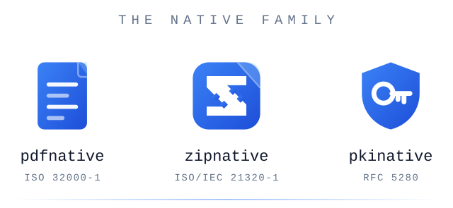

<div align="center">
  <picture>
    <source media="(prefers-color-scheme: dark)" srcset="assets/banner-dark.svg">
    
  </picture>
</div>

# Nizoka

**Zero-dependency TypeScript engines for the formats nobody wants to reimplement — PDF, ZIP, PKI.**

Most of this code was drafted by AI agents. None of it was *shipped* by one: there is no long-lived publish token anywhere in this ecosystem, so the only path to the registry is a release a human cut by hand. [How this is built ↓](#how-this-is-built)

## Start here

```bash
npm install pdfnative
```

```ts
import { buildDocumentPDFBytes, extractText } from 'pdfnative';

const pdf = buildDocumentPDFBytes({
  title: 'Hello',
  blocks: [{ type: 'paragraph', text: 'Hello, world.' }],
});

extractText(pdf)[0].text; // 'Hello, world.' — it parses, too
```

Prefer a shell? `npx pdfnative-cli render -o out.pdf`. Driving an agent? `npx pdfnative-mcp`. Same engine behind all three.

## The native family

The engine is the library; the CLI is the trust boundary the engine refuses to be; the MCP server is the same capability, addressable by an agent. Each engine exiles its integrations — filesystem sinks, process I/O, the MCP SDK — into satellite repos, so the core can stay dependency-free.

| Package | Latest | What it does |
| --- | --- | --- |
| **[pdfnative](https://github.com/Nizoka/pdfnative)** | [](https://www.npmjs.com/package/pdfnative) | **0 deps.** PDF engine — ISO 32000-1, PDF/A-1b→3b, PDF/X-4, PAdES B-B→B-LTA signing, 27 scripts shaped with GSUB/GPOS, no fontkit |
| [pdfnative-cli](https://github.com/Nizoka/pdfnative-cli) | [](https://www.npmjs.com/package/pdfnative-cli) | 21 commands — render, sign, verify, LTV, inspect, compare, batch |
| [pdfnative-mcp](https://github.com/Nizoka/pdfnative-mcp) | [](https://www.npmjs.com/package/pdfnative-mcp) | 28 MCP tools, no network path by default |
| [pdfnative-react](https://github.com/Nizoka/pdfnative-react) | [](https://www.npmjs.com/package/pdfnative-react) | JSX → PDF. No DOM, no headless browser, no SaaS round-trip |
| **[zipnative](https://github.com/Nizoka/zipnative)** | [](https://www.npmjs.com/package/zipnative) | **0 deps.** ZIP engine — own DEFLATE/INFLATE, Zip64, random access without extracting, incremental edits without recompression |
| [zipnative-cli](https://github.com/Nizoka/zipnative-cli) | [](https://www.npmjs.com/package/zipnative-cli) | 15 commands — zip-slip, symlink, bomb and duplicate guards on by default |
| [zipnative-mcp](https://github.com/Nizoka/zipnative-mcp) | [](https://www.npmjs.com/package/zipnative-mcp) | 13 MCP tools, sandboxed to one directory, verified by realpath |
| **pkinative** | `0.1` | **0 deps.** X.509 / ASN.1 DER engine — [see below](#now-building) |

Engines carry zero runtime dependencies; satellites carry zero *extra* ones. For scale, measured 2026-07-28: pdfkit ships 6 runtime dependencies, pdf-lib 4, jsPDF 3, pdfmake 3.

One API surface. Node.js ≥ 22 and browsers run in CI; Deno, Bun and Workers follow from the architecture but are not yet a tested matrix. MIT, all of it.

## The doctrine

Four rules, inherited down the family. Each is enforced by code somewhere — and the row says where.

| Rule | Enforced by |
| --- | --- |
| **Zero runtime dependencies** | The engines declare no `dependencies` at all. In pdfnative and pkinative, tree-shaking probes bundle isolated imports against byte budgets *and* forbidden-marker assertions — importing a color parser must not drag in an AES S-box. |
| **Secure-by-default parsing** | Every loop over untrusted bytes consults a **named limit**, the riskiest tagged with its CWE. pkinative's ASN.1 decoder is iterative: depth is a bounded number, never the call stack. |
| **Determinism as a product feature** | Byte-identical output, buffered or streaming, serial or parallel — and across runtimes under `deterministic: true`. Changing those bytes is a **semver-major**. |
| **No I/O in the engine** | No filesystem, no network, no `process`, no `eval`. The only `node:` touch is an optional `zlib` fast path that the pure-TypeScript codec replaces when it is absent. In pkinative an architecture test decides this from the syntax tree and fails the build. |

## How this is built

Every repo carries `AGENTS.md`, `.github/AGENT_RULES.md` and a machine-readable `.github/ai-governance.json`. They assign exactly one role to the agent and one to the human:

> **You act as a draftsman, never as an autonomous submitter.**

```json
"human_in_the_loop": {
  "role_of_agent": "draftsman",
  "gate": "A human MUST explicitly review, sign off on, and trigger any …"
}
```

In full, the gate ends: *the agent's authority ends at producing a local draft plus a compliance report.* That is the policy. This is the enforcement: in pdfnative, pdfnative-cli and pkinative, a `PreToolUse` hook denies `npm publish`, `gh pr create`, `gh release` and **any `git push`** — including when the command is buried inside `$( )`, `sh -c` or a `node -e` payload. Its rule table has its own test file. Weaken the governance and the build fails.

```
agent drafts
   ↓
local reproduction
   ↓
zero-dependency check
   ↓
draft + compliance report
   ↓
human reviews & signs off   ← the gate
   ↓
human submits. never the agent.
```

And the line the agent must repeat before every submission, straight out of `ai-governance.json`: anything submitted is published under the human's GitHub identity, and the human shares responsibility for the content.

**Agents draft. Gates decide. A human signs.**

## Verified, not claimed

Every line below is a CI job against an outside corpus — not a badge someone drew.

- **veraPDF** — PDF/A conformance across the pdfnative repos, including negative canaries the validator is required to *reject*. Blocking in three of them; still advisory in `pdfnative-mcp`.
- **ISO/IEC 21320-1** — clause by clause, fail-closed, on Linux and Windows. No external ZIP validator exists — JHOVE has no ZIP module — so this one is the project's own; the corpus and its negative canaries are what make it a test rather than a claim.
- **x509-limbo + Wycheproof** — 30 361 certificates and 1 530 ECDSA vectors, pinned by commit and SHA-256, differentially cross-checked against OpenSSL. Every refusal is justified in a reviewed baseline.
- **npm Trusted Publishing (OIDC) + SLSA provenance** — on all seven published packages. No long-lived token exists anywhere.

Each engine keeps an `ecosystem.json` as the single source of truth for every number its own docs quote, and a `verify:docs` step breaks the build when the prose disagrees. The satellite repos do not have that gate yet.

## Now building

**pkinative** — a zero-dependency X.509 and ASN.1 DER engine, extracted from pdfnative's signature stack and destined to return to it.

Stated plainly: 0.1, pre-1.0, and **deliberately unreleased** — the name is reserved on npm, but the publish workflow fails on purpose below 1.0.0. Today it reads certificates, strictly: DER by default, BER only on request, every standard RFC 5280 extension, with the conformance gate above already in place. It does **not** verify signatures or validate chains yet — those are the next two milestones. And secret-dependent cryptography will never be written in TypeScript here: Web Crypto only.

Of the TypeScript PKI libraries measured on 2026-09-19, only pkinative and micro509 ship zero dependencies — asn1js 3, pkijs 6, `@peculiar/x509` 11.

---

<sub>MIT · [pdfnative.dev](https://pdfnative.dev) · [zipnative.dev](https://zipnative.dev) · pkinative.dev *(soon)* · [Sponsor on GitHub](https://github.com/sponsors/Nizoka)</sub>
